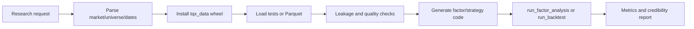

# HK/US Quant Research Skill

[中文](README.md) | English

`skill-tqx-research` uses `tqx_data` and local Parquet to generate and execute factor analysis or strategy backtests for Hong Kong and US equities. It turns a research request into code, data retrieval, execution, validation, and a real result.

## Capabilities

- Factor analysis: momentum, reversal, volatility, price-volume, technical, and custom factors.
- Time-series backtests: MA, breakout, RSI, momentum, and entry/exit rules.
- Cross-sectional backtests: rank a universe, select groups or Top-N, weight, and rebalance.
- Diagnostics: data quality, look-ahead leakage, cost sensitivity, and result credibility.

The generated task code belongs in `scripts/tests/`. The skill runs locally without a CLI wrapper or another project and does not place live orders.

## Fast data path

```text
request -> existing tests panel -> .env local Parquet -> tqx_data SDK
-> contract check -> generated code -> run_factor_analysis/run_backtest -> report
```

Stop at the first non-empty source with required fields. Query only the requested market, universe, dates, and columns; batch symbols and reuse the DataFrame instead of probing the same API repeatedly.

## Setup

Use Python 3.12. Install and import the supplied `tqx_data` wheel before accessing local Parquet; the wheel is the required SDK adapter. Then install `requirements.txt`, copy `.env.example` to `.env`, and set `PARQUET_ROOT_PATH`. Never commit `.env`, real paths, credentials, tokens, market data, or generated reports. Prefer a UNC path when mapped drives may differ across Windows Agent sessions.

The daily panel should contain at least:

```text
date, symbol, open, high, low, close, volume
```

Cross-sectional factor analysis requires multiple symbols for each date. Signals at time `t` may only use information available at or before `t`; forward returns must be shifted in the future direction.

## Research workflows

Factor analysis: validate panel -> calculate factor -> optional cross-sectional cleaning -> forward returns -> IC/Rank IC -> groups -> decay -> credibility.

Strategy backtest: signal -> next tradable execution point -> positions -> costs -> equity curve. Cross-sectional strategies additionally require explicit universe, ranking, weights, and rebalance dates.

## Output contract

Factor reports include definition, market/universe, dates, sample size, IC, Rank IC, ICIR, grouped returns, decay, and credibility. Backtests include rules, capital, cost assumptions, total and annualized return, maximum drawdown, Sharpe, trade count, final equity, and credibility. Never fabricate metrics when data or code fails; return the exact root cause and repair action.

## Agent examples

```text
Use skill-tqx-research to analyze a 5-day HK momentum factor with 5-day rebalancing.
Use local Parquet and return IC, Rank IC, ICIR, quintile returns, decay, and credibility.
```

```text
Use skill-tqx-research to backtest a TSLA 7/20-day MA crossover on US daily data.
Return assumptions, performance metrics, trade summary, and credibility checks.
```

See `references/factor_codegen_assistant.md`, `references/strategy_codegen_assistant.md`, `references/research_rules.md`, `references/output_contract.md`, and `scripts/research_nodes.py`.

## Production Pipeline



## Problem Solved

Turns HK/US research requests into reproducible data loading, factor analysis, and backtesting with consistent data policy, look-ahead protection, metrics, and actionable failures.

## Input Data Requirements

Daily panels require `date, symbol, open, high, low, close, volume`. Factor analysis needs factor columns and multiple symbols per date for cross-sectional work; time-series backtests may use one symbol. Dates and market suffixes must be valid.

## Generated Factor Structure

```text
date | symbol | factor_* | fwd_return_1d/3d/5d/10d/20d
```

Factors use only information available at the observation time. Forward returns are shifted from future prices. Generated task code is saved under `scripts/tests/`.

## Validation Metrics

Factors: coverage, IC, Rank IC, ICIR, grouped returns, decay, and sample size. Strategies: total and annualized return, maximum drawdown, Sharpe, trade count, final equity, turnover, and cost sensitivity.

## Install in an Agent Environment

Copy this directory into the Agent skills directory, install the wheel and dependencies in Python 3.12, copy `.env.example` to `.env`, and set the local Parquet path. Any compatible Agent can use the skill when `SKILL.md` is at the skill root.

## Repository Contents

`SKILL.md`, bilingual README files, `references/` contracts, `scripts/research_nodes.py` execution nodes, `scripts/tests/` task code, and `agents/openai.yaml` metadata.

## License

GPL-3.0. Research output is not investment advice.

## PandaAI / QUANTSKILLS Community

PandaAI / QUANTSKILLS provides a community for quantitative research, Agents, and Skills: <https://github.com/quantskills>.
