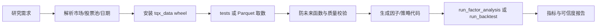

# 港股/美股量化研究 Skill

[English](README.en.md) | 中文

`tqx-data-research` 使用 `tqx_data` 与本地 Parquet 数据，为港股和美股自动生成并执行因子分析或策略回测代码。它面向研究任务：从用户的一句话需求中确认参数、取数、生成代码、运行分析、校验可信度并返回真实结果。

## 能解决什么问题

- 因子分析：动量、反转、波动率、量价、技术指标及用户自定义因子。
- 时序回测：单只或多只股票的均线、突破、RSI、择时等规则。
- 截面回测：按交易日对股票池打分、排序、分组、选股和定期调仓。
- 研究诊断：数据质量、未来数据泄露、成本敏感性和结果可信度。

本 Skill 不负责实时下单。研究代码直接写入本 Skill 的 `scripts/tests/`，不依赖外部 CLI 或其他项目运行。

## 执行流程

```text
用户需求
  -> 识别市场、标的/股票池、日期和参数
  -> tqx_data + 本地 Parquet 取数
  -> 数据契约与未来函数检查
  -> 生成因子分析或策略回测代码
  -> run_factor_analysis 或 run_backtest
  -> 指标、可信度和失败原因
  -> Agent 返回结果
```

## 环境安装

要求 Python 3.12。必须先安装并成功导入项目提供的 `tqx_data` wheel；只有 wheel 就绪后才能通过 SDK 访问本地 Parquet。然后安装依赖：

```powershell
py -3.12 -m venv .venv
.\.venv\Scripts\Activate.ps1
python -m pip install --upgrade pip
python -m pip install <tqx_data-wheel路径>
python -m pip install -r requirements.txt
```

从示例创建本地配置：

```powershell
Copy-Item .env.example .env
```

在 `.env` 中设置 `PARQUET_ROOT_PATH`。`.env`、真实数据路径、账号、密码、Token、生成报告和本地数据均不得提交 Git。网络映射盘在不同 Windows 会话中可能不可见，生产环境优先使用当前会话可访问的 UNC 路径。

## 数据要求与快速取数

日线面板至少需要：

```text
date, symbol, open, high, low, close, volume
```

因子分析还需要同一交易日的多只股票；时序策略可以只使用单一标的。Agent 应优先读取 `.env`、本地 Parquet 和已有 `scripts/tests/` 样例，只取目标市场、日期、股票池和必要字段，不应无条件扫描全库。

取数失败时依次检查：路径可见性、市场接口、代码格式、日期格式、字段名和空表。不得因为取数失败而编造指标，也不得把“缺少用户参数”作为默认停止理由；常见参数可采用明确披露的研究默认值。

## 两类任务口径

### 因子分析

标准链路为：面板校验 -> 因子计算 -> 截面去极值/标准化（按任务需要）-> 未来收益 -> IC/Rank IC -> 分组收益 -> 衰减 -> 可信度。

必须防止未来数据泄露：时点 `t` 的因子只能使用 `t` 及以前的数据；未来收益必须通过向后移动价格构造；调仓日和收益窗口需要明确。

至少返回：因子定义、市场与股票池、日期范围、样本量、IC、Rank IC、ICIR、分组收益、衰减和可信度结论。

### 策略回测

时序策略链路为：信号 -> 下一可交易时点成交 -> 持仓 -> 成本 -> 收益曲线。截面策略链路为：股票池 -> 截面打分 -> 排序选股 -> 权重 -> 调仓 -> 组合收益。

至少返回：策略规则、回测区间、初始资金、成本假设、总收益、年化收益、最大回撤、Sharpe、交易次数和最终净值。策略收益必须与基准或买入持有口径区分。

## 可信度要求

结论前必须检查：样本量、缺失与重复、停牌/上市状态、复权口径、信号与成交错位、幸存者偏差、交易成本、极端行情依赖和参数敏感性。发现问题时给出影响范围和可执行修复建议，而不是只返回报错文本。

## Agent 提示词示例

```text
参考 tqx-data-research，给我做港股 5 日动量因子分析，每 5 个交易日调仓，
使用本地 Parquet，返回 IC、Rank IC、ICIR、五组收益、衰减和可信度结论。
```

```text
参考 tqx-data-research，回测 TSLA 的 7/20 日均线金叉死叉策略，
使用美股日线，给出完整参数、收益指标、交易明细摘要和结果可信度。
```

## 目录说明

| 路径 | 用途 |
|---|---|
| `SKILL.md` | Agent 的短入口和强制规则 |
| `references/factor_codegen_assistant.md` | 因子代码生成规则 |
| `references/strategy_codegen_assistant.md` | 策略代码生成规则 |
| `references/research_rules.md` | 研究、成本与防泄露规则 |
| `references/output_contract.md` | 结果字段和可信度要求 |
| `references/source_boundary.md` | 数据来源与调用边界 |
| `references/prompt_template.md` | 小白可直接使用的提示词 |
| `scripts/research_nodes.py` | 因子分析与回测公共节点 |
| `scripts/tests/` | Agent 新生成的任务代码与验证样例 |

本 Skill 仅用于研究与验证，输出不构成投资建议。

## 生产流水线



## 这个 Skill 解决什么问题

把港股、美股研究需求转成可复现的取数、因子分析和策略回测流程，统一数据口径、未来信息处理、指标计算和失败说明，避免 Agent 只给概念而没有结果。

## 输入数据要求

日线面板至少包含 `date, symbol, open, high, low, close, volume`。因子分析需要因子列和同日多个标的（截面任务）；时序回测可为单标的。日期必须可排序，标的代码必须带正确市场后缀。

## 生成出来的因子结构

```text
date | symbol | factor_* | fwd_return_1d/3d/5d/10d/20d
```

因子列只使用当日及以前信息，远期收益使用未来价格向后移动构造；生成代码保存到 `scripts/tests/`。

## 验证指标

因子：覆盖率、IC、Rank IC、ICIR、分组收益、衰减和样本量。策略：总收益、年化收益、最大回撤、Sharpe、交易次数、最终净值、换手和成本敏感性。

## 安装到智能体环境

将本目录复制到 Agent 的 skills 目录，并在 Python 3.12 环境安装 wheel 与依赖；复制 `.env.example` 为 `.env`，设置本地 Parquet 路径。不同 Agent 只需保持 `SKILL.md` 位于技能根目录。

## 仓库内容

`SKILL.md`、`README.md`、`README.en.md`、`references/`（研究规则与代码生成契约）、`scripts/research_nodes.py`（执行节点）、`scripts/tests/`（任务代码）、`agents/openai.yaml`。

## License

GPL-3.0。研究结果不构成投资建议。

## PandaAI / QUANTSKILLS 社群

PandaAI / QUANTSKILLS 社群提供量化研究、Agent 和 Skill 实践交流：<https://github.com/quantskills>。
